# Lab7Web
## Ananda Fachri Reynaldi
## 312110248
## TI.21.B1
<br>
<b>XAMPP</b>

Karena menggunakan XAMPP Portable setelah download lalu Extract file tersebut, pindahkan direktorinya (misal: d:\xampp)
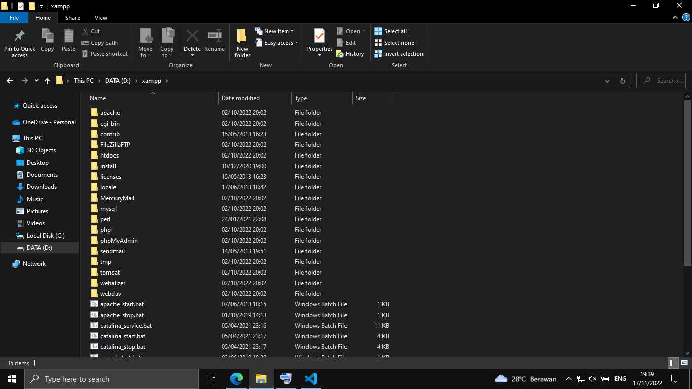

Buka XAMPP Control Lalu Klik `Start` untuk menjalankan Web Server. Setelah itu uji coba gunakan URL :
```
http://localhost
```
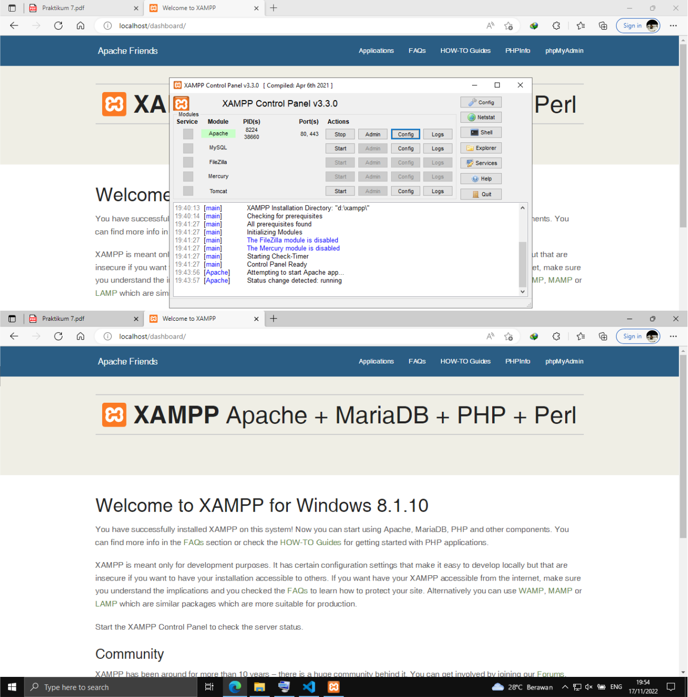<br>

<b>PHP Dasar</b>

Membuat folder lab7_php_dasar pada root directory web server (d:\xampp\htdocs). Setelah itu uji coba gunakan URL :
```
http://localhost/lab7_php_dasar/
```
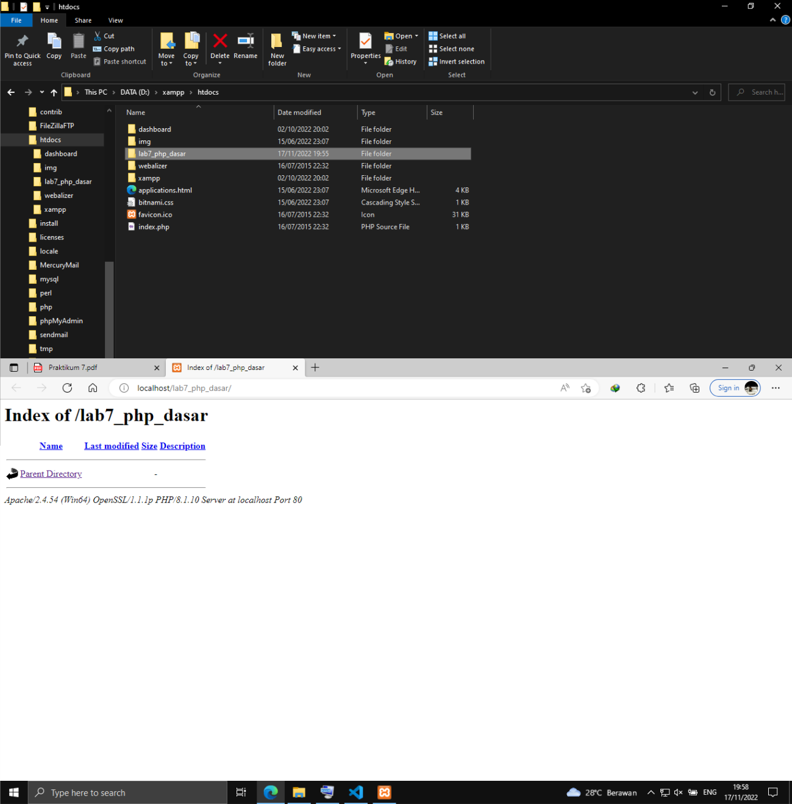

Membuat file baru dengan nama php_dasar.php <br>
untuk mengakses hasilnya gunakan URL : 
```
http://localhost/lab7_php_dasar/php_dasar.php
```
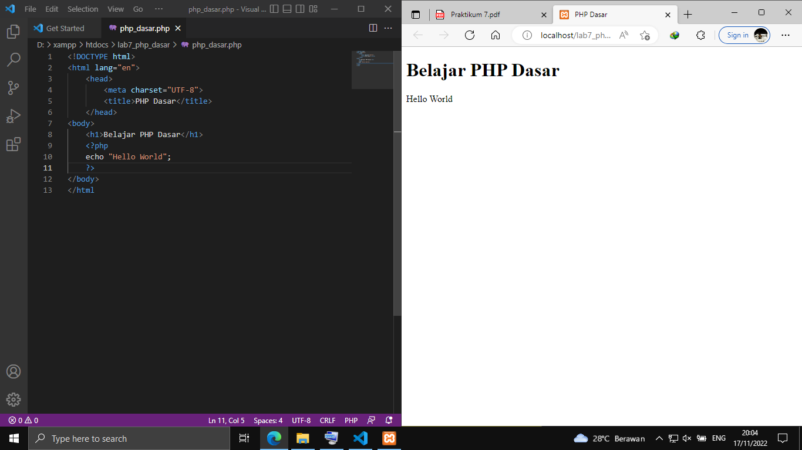<br>

<b>Variable PHP</b>

Menambahkan variable berikut :
```
<h2>Menggunakan Variable</h2>
    <?php
    $nim = "312110248";
    $nama = 'Ananda Fachri Reynaldi';
    echo "NIM : " . $nim . "<br>";
    echo "Nama : $nama";
    ?>
```
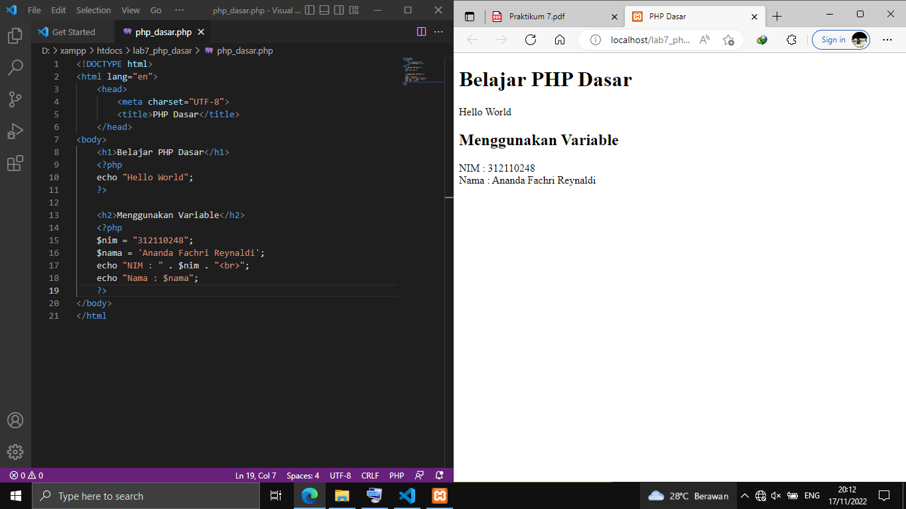

Membuat Predefine Variable $_GET<br>
Untuk mengaksesnya hasilnya gunakan URL: 
```
http://localhost/lab7_php_dasar/latihan2.php?nama=Reynaldi
```
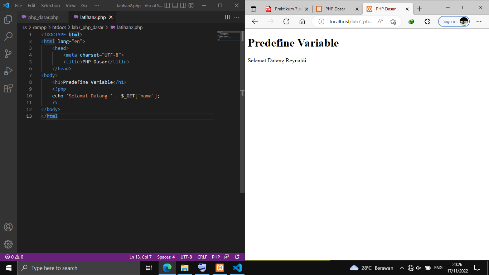<br>

Membuat Form Input
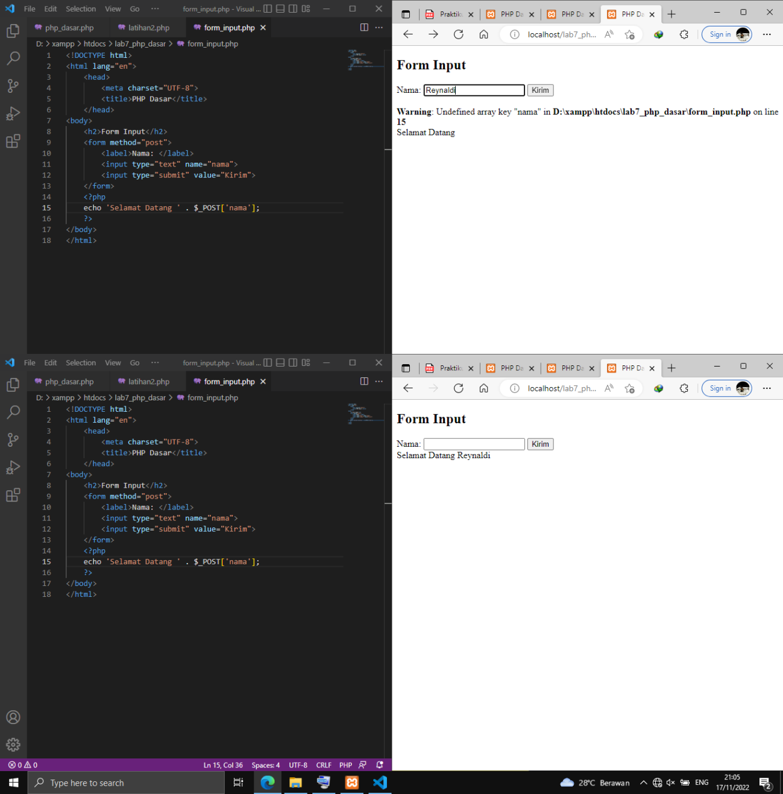<br>

Operator
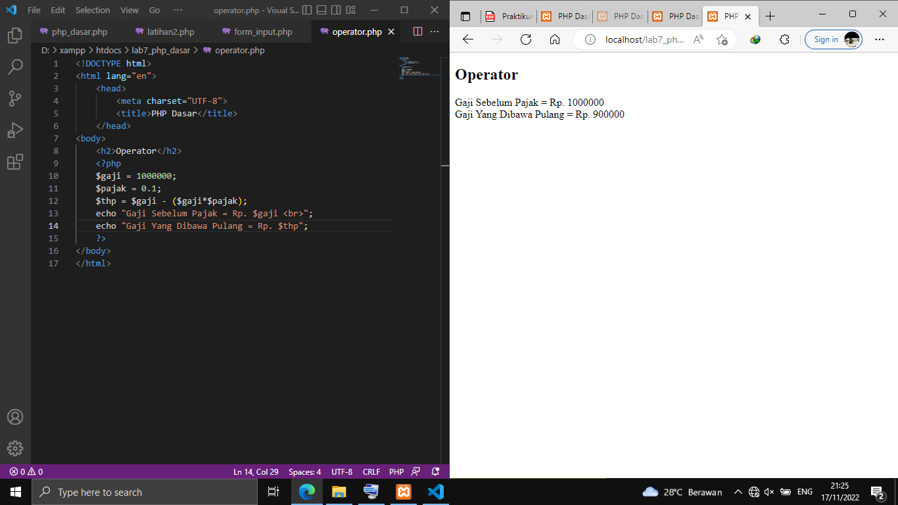<br>

Kondisi IF
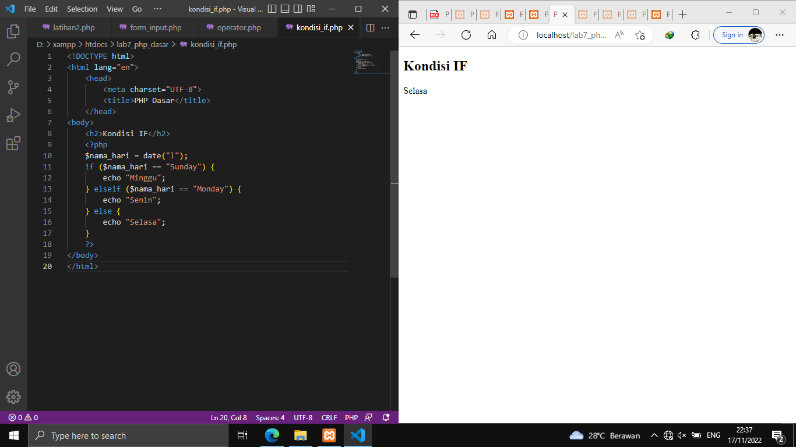<br>

Kondisi Switch
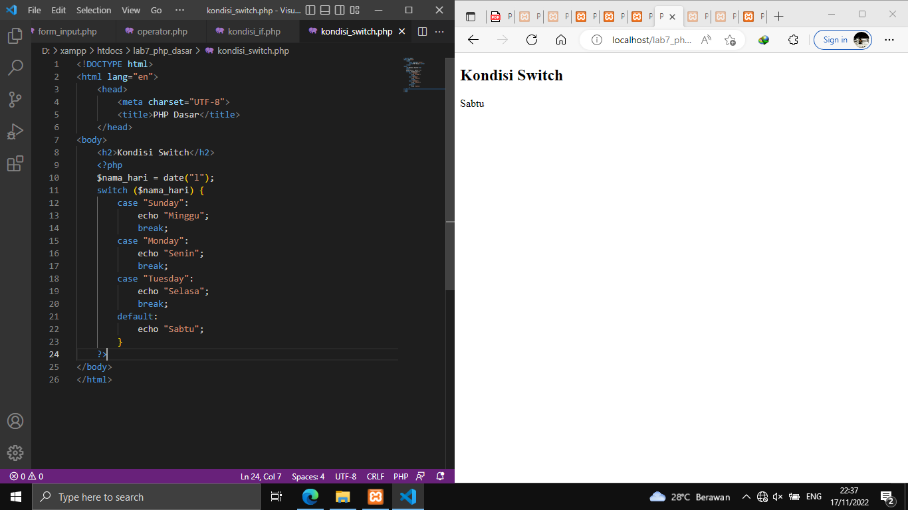<br>

Perulangan For
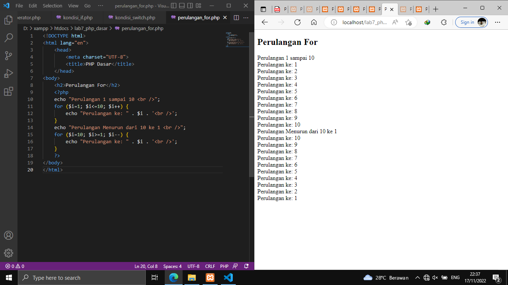<br>

Perulangan While
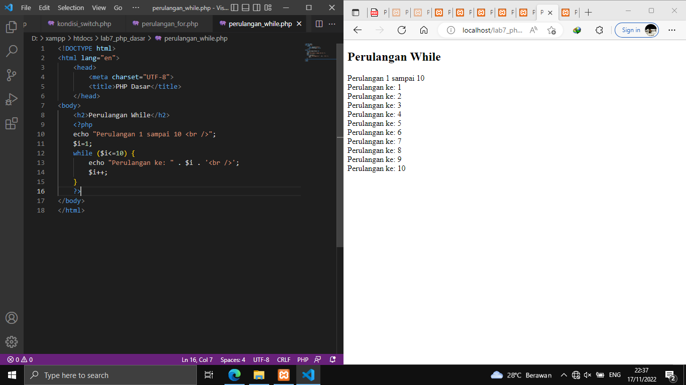<br>


